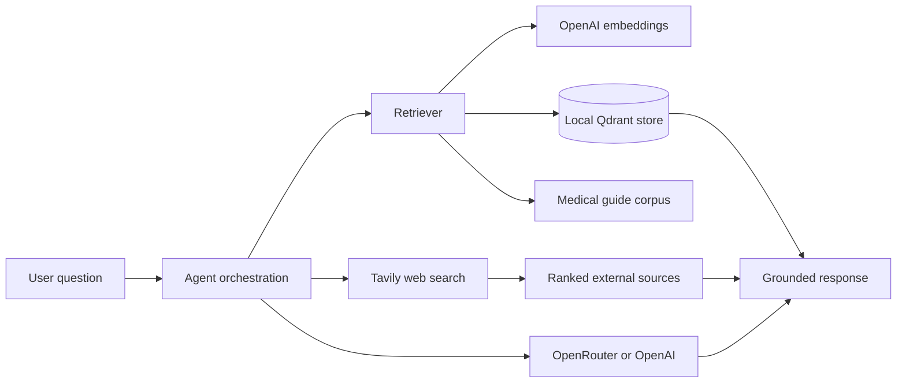

# Agentic Medical Assistant

Configurable medical-information assistant with local vector retrieval, model routing, web search, and agent-pattern notebooks.

[](https://www.python.org/)
[](https://platform.openai.com/docs/guides/embeddings)
[](https://qdrant.tech/)
[](https://tavily.com/)
[](#license)
[](#limitations--future-work)

## Problem / Motivation

Healthcare information assistants need grounded answers, transparent sources, and a way to retrieve current information when a private knowledge base is incomplete. This project explores those requirements with a synthetic medical knowledge base. It is an engineering playground for testing reflection, tool use, ReAct, and multi-agent orchestration patterns. It is not a clinical decision-making system.

## Demo

The current demonstrations are notebook-based. Start Jupyter, open a notebook, and run its cells from top to bottom:

- [Reflection](notebooks/reflection.ipynb)
- [Tool use](notebooks/tool_use.ipynb)
- [ReAct](notebooks/react.ipynb)
- [Multi-agent orchestration](notebooks/multi_agent.ipynb)

Each notebook demonstrates a different workflow: self-critique and refinement, external tool calls, reason-and-act loops, or collaboration between specialized agents.

## Architecture



## Key Results

| Capability | Evidence in repository | Status |
| --- | --- | --- |
| Local retrieval | `rag/retriever.py` with local Qdrant persistence | Implemented |
| Document ingestion | TXT, PDF, and DOCX readers | Implemented |
| Configurable generation | OpenRouter and OpenAI model configurations | Implemented |
| External knowledge | Tavily search tool with source formatting | Implemented |
| Agent patterns | Reflection, tool-use, ReAct, and multi-agent notebooks | Demonstrated |

No benchmark accuracy or latency results are reported yet; evaluation data and repeatable measurement scripts are future work.

## Tech Stack

Python 3.10+ | OpenAI | OpenRouter | Qdrant | Tavily | tiktoken | PyYAML | Jupyter

## Quick Start

```powershell
git clone <repository-url>
cd agentic-rag
python -m venv .venv
.\.venv\Scripts\Activate.ps1
pip install -r requirements.txt
jupyter notebook
```

Create a `.env` file before running API-backed notebooks:

```env
OPENROUTER_API_KEY=your_openrouter_api_key
OPENAI_API_KEY=your_openai_api_key
TAVILY_API_KEY=your_tavily_api_key
```

Runtime parameters live in [`config/params.yaml`](config/params.yaml), and model aliases live in [`config/models.yaml`](config/models.yaml).

## How to Run a Demo

1. Start the environment and Jupyter from the repository root:

    ```powershell
    .\.venv\Scripts\Activate.ps1
    jupyter notebook
    ```

2. Open `notebooks/reflection.ipynb`, `notebooks/tool_use.ipynb`, `notebooks/react.ipynb`, or `notebooks/multi_agent.ipynb`.
3. Select the Python interpreter from `.venv` when prompted.
4. Run the cells in order with **Run All**.
5. Ask questions grounded in the documents under `data/medical_guides/` and inspect the generated response, retrieved context, and tool results.

The notebooks require valid API keys. The retrieval layer stores its local Qdrant data under `store/`. Delete that generated data only when you want to rebuild the local index.

For direct component experiments, the retriever and web search tool can be imported from Python:

```python
from rag.retriever import MedicalKnowladgeRetriever
from tools.web_search import WebSearchTool

retriever = MedicalKnowladgeRetriever()
web_search = WebSearchTool()
```

## Project Structure

```text
agentic-rag/
├── 📁 README.md                         # Project overview and usage guide
├── 📁 requirements.txt                  # Python dependencies
├── 📁 .env                              # Local API keys; do not commit
├── 📁 config/
│   ├── 📁 models.yaml                   # Provider and model aliases
│   └── 📁 params.yaml                   # Runtime, RAG, paths, and web settings
├── 📁 data/
│   ├── 📁 booking.json                  # Booking-related sample data
│   └── 📁 medical_guides/
│       ├── 📁 appointment_preparation.txt
│       ├── 📁 common_conditions.txt
│       └── 📁 general_health.txt
├── 📁 notebooks/
│   ├── 📁 reflection.ipynb               # Reflection workflow
│   ├── 📁 tool_use.ipynb                 # Tool-calling workflow
│   ├── 📁 react.ipynb                    # ReAct workflow
│   └── 📁 multi_agent.ipynb              # Multi-agent workflow
├── 📁 rag/
│   └── 📁 retriever.py                  # Document loading, chunking, embeddings, Qdrant retrieval
├── 📁 tools/
│   ├── 📁 web_search.py                 # Tavily web-search tool
│   └── 📁 booking.py                    # Booking tool integration
├── 📁 utils/
│   ├── 📁 __init__.py                  # Public utility exports
│   ├── 📁 config_utils.py              # YAML and environment configuration
│   ├── 📁 llm_utils.py                 # LLM provider and tool registry abstractions
│   └── 📁 token_utils.py               # Token counting helpers
└── 📁 store/                            # Generated local Qdrant persistence
```

## Design Decisions

- Keep configuration in YAML so model, retrieval, chunking, and path settings can change without code edits.
- Use local Qdrant persistence to make retrieval reproducible without managing a hosted vector database.
- Keep web search as an explicit tool so external evidence can be separated from internal documents.
- Use provider-neutral model aliases to switch between OpenRouter and OpenAI configurations.
- Include token utilities because context budgets are a first-class constraint in agent workflows.

## Limitations / Future Work

- The corpus is synthetic and the provider integrations still need end-to-end evaluation with real workloads.
- There is no production API, UI, authentication layer, or automated deployment yet.
- Add retrieval and answer-quality benchmarks, citation checks, tracing, and regression tests.
- Add a complete runnable pipeline that connects ingestion, retrieval, tool calls, reflection, and response generation.

## License

MIT.
